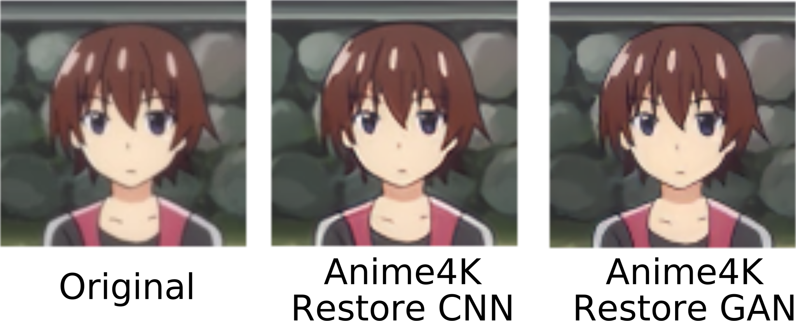
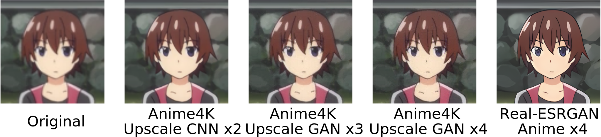
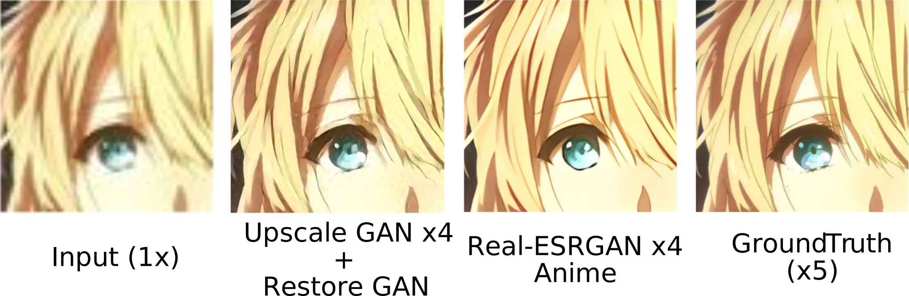
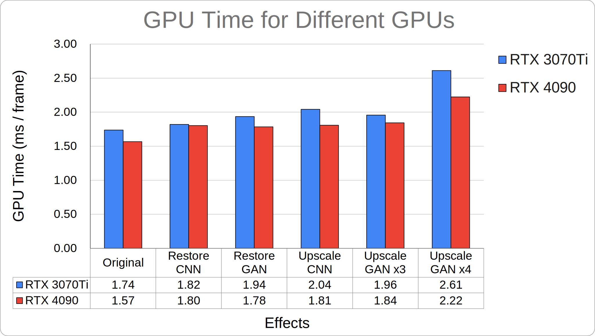
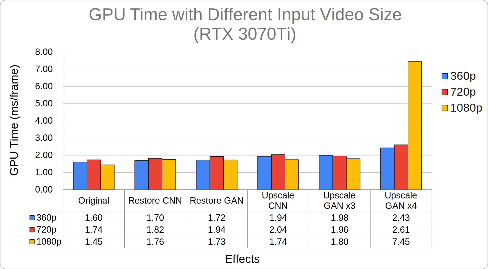

# Anime4K-WebGPU

University of Pennsylvania, CIS 565: GPU Programming and Architecture, Final Project

Authors (alphabetical order with equal contribution):
* Ruijun(Daniel) Zhong [LinkedIn](https://www.linkedin.com/in/daniel-z-73158b152/) | [Personal Website](https://www.danielzhongportfolio.com/)
* Tong Hu  [LinkedIn](https://www.linkedin.com/in/tong-hu-5819a122a/) | [Personal Website](https://www.tong-hu.com/)
* Yuanqi Wang [LinkedIn](https://www.linkedin.com/in/yuanqi-wang-414b26106/) | [GitHub](https://github.com/plasmas) | [Personal Website](https://www.yqwong.com/)

## Introduction


An [Anime4K](https://github.com/bloc97/Anime4K) implementation for WebGPU, featuring video enhancements including upscaling, denoising, and deblurring. Computing is done entirely on the client side using WebGPU compute shaders. Functionality of this implementation is published as an [NPM package](https://www.npmjs.com/package/anime4k-webgpu), and can be easily incorporated into your WebGPU pipeline.

Take a look at our web demo at https://anime4k-webgpu-demo.fly.dev/ ([Source](https://github.com/Anime4KWebBoost/Anime4K-Web-Demo))

Note: your browser must support WebGPU. See this [list](https://caniuse.com/webgpu) for compatibility.

## Usage

There are 2 ways to use this package:

### 1. Render Wrapper

This is for frontend devs who do not wish to tap into WebGPU too much. An React example can be found [here](./examples/react-renderer.tsx).

You only need the `render` function which will setup all the rendering from a video element to a canvas element:

```typescript
import { CNNx2UL, GANUUL, render } from 'anime4k-webgpu';

await render({
  // your source video HTMLElement
  video,
  // your render destination canvas HTMLElement
  canvas,
  // your function to build custom pipeline
  // return all pipelines in order of execution
  // e.g. inputTexture(video) -> CNNx2UL -> GANUUL -> (canvas)
  pipelineBuilder: (device, inputTexture) => {
    const upscale = new CNNx2UL({
      device,
      inputTexture,
    });
    const restore = new GANUUL({
      device,
      inputTexture: upscale.getOutputTexture(),
    });
    return [upscale, restore];
  },
});
```

In the upper example, the input texture (vide) will go through a `CNNx2UL` for upscaling, and then a `GANUUL` for restore, before it is rendered to the canvas. You will build your custom pipeline in the `pipelineBuilder` function.

Alternativey, to use a [preset mode](https://github.com/bloc97/Anime4K/blob/master/md/GLSL_Instructions_Advanced.md), native texture resolution and render target resolution are needed to setup the correct pipeline combinations:

```typescript
import { ModeA, render } from 'anime4k-webgpu';

await render({
  video,
  canvas,
  // inputTexture(video) -> Mode A -> (canvas)
  pipelineBuilder: (device, inputTexture) => {
    const preset = new ModeA({
      device,
      inputTexture,
      nativeDimensions: {
        width: video.videoWidth,
        height: video.videoHeight,
      },
      targetDimensions: {
        width: canvas.width,
        height: canvas.height,
      }
    })
    return [preset];
  },
});
```

### 2. WebGPU Pipelines

If you already have a webGPU render pipeline setup and would like to use Anime4K on an existing texture, 

This package contains classes that implements interface `Anime4KPipeline`. To use these classes, first install `anime4k-webgpu` package, then insert proveded pipelines in 4 lines:

```typescript
// +++ import CNNx2UL, one of the CNN upscale pipeline +++
import { Anime4KPipeline, CNNx2UL } from 'anime4k-webgpu';

// your original texture to be processed
const inputTexture: GPUTexture;

// +++ instantiate pipeline +++
const pipeline: Anime4KPipeline = new CNNx2UL({
  device,
  inputTexture
});

// bind (upscaled) output texture wherever you want e.g. render pipeline
const renderBindGroup = device.createBindGroup({
  ...
  entries: [{
    binding: 0,
    // +++ use pipeline.getOutputTexture() instead of inputTexture +++
    resource: pipeline.getOutputTexture().createView(),
  }]
});

function frame() {
  const commandEncoder: GPUCommandEncoder;

  // +++ inject commands into the encoder +++
  pipeline.pass(commandEncoder);

  // begin other render pass...
}
```

To change an adjustable parameter (e.g. deblur strength) call `Anime4KPipeline::updateParam(param: string, value: any)` and the value will be applied for the next render cycle:
```typescript
pipeline.updateParam('strength', 3.0);
```

The input texture must have usage `TEXTURE_BINDING`, and the output texture has `TEXTURE_BINDING | RENDER_ATTACHMENT | STORAGE_BINDING` to be used in render pipelines. You can also have multiple pipelines in tandem to achieve sophisticated effects.

### Supported Pipelines

This package currently support the following pipelines and presets (items marked as ❌ are still in progress):

* Deblur
  * ✅ DoG
* Denoise
  * ✅ BilateralMean
* Restore
  * ✅ CNNM
  * ✅ CNNSoftM
  * ✅ CNNSoftVL
  * ✅ CNNVL
  * ✅ CNNUL
  * ✅ GANUUL
* Upscale
  * ✅ CNNx2M
  * ✅ CNNx2VL
  * ✅ DenoiseCNNx2VL
  * ✅ CNNx2UL
  * ✅ GANx3L
  * ✅ GANx4UUL
* Other Helpers
  * ✅ AutoDownscalePre
  * ✅ ClampHighlights
* Preset Mode Collections (see also [link](https://github.com/bloc97/Anime4K/blob/master/md/GLSL_Instructions_Advanced.md))
  * ✅ ModeA
  * ✅ ModeB
  * ✅ ModeC
  * ✅ ModeAA
  * ✅ ModeBB
  * ✅ ModeCA

## Performance Analysis
### Visualization Comparisons
Following comparisons are done with a 360p image as input. The image is from Anime4K repo.

**1. Compare with Denoise & Deblur effects**

After applying denoise effect, the image become smoother. The intensity sigma is set to 0.2 and the spatial sigma is set to 2. Increasing intensity sigma will make bilateral filter approximat Gaussian convolution, and increasing the spatial sigma will make the color smoother. 

For the denoise effect, deblurring strength has been calibrated to a level of 7. As deblurring strength increasing, the effect of deblur is more distinct. This deblurring process enhances the video's clarity by sharpening the image's edges. However, it's important to note that this enhancement may also inadvertently amplify aliasing effects.

<div align="center">

<p>Figure 1. Compare with Denoise & Deblur effect</p>
</div>

**2. Compare with restore CNN and restore GAN effects**

Utilizing restoration models on the image enhances its clarity and sharpens its edges, yet it may also result in the introduction of some aliasing. The restore GAN model, being larger in size compared to the restore CNN model, excels in enhancing edge details. However, this comes with a trade-off as it tends to introduce a greater degree of aliasing. The restoration process will enhance the image's clarity without altering its dimensions.

<div align="center">

<p>Figure 2. Compare with restore CNN and restore GAN</p>
</div>

**3. Compare with upscale CNN (x2) and upscale GAN (x3 & x4) and the Real-ESRGAN effects**

Utilizing upscale CNN and upscale GAN techniques results in an increase in image size as these models aim to upscale the image, enhancing its resolution. Among these models, the upscale GAN x4 stands out as the most substantial, producing an output image that is four times larger in both width and height, yielding the most impressive results among the three upscale models. The Real-ESRGAN result is generated by [webgpu-super-resolution](https://github.com/sona1111/webgpu-super-resolution). We have upgraded the project for compatibility with the latest WebGPU standards, allowing the original image to be processed correctly. Although Real-ESRGAN delivers the sharpest image, it is significantly slower—approximately 1000 times more so. Our project is focused on achieving real-time video upscaling, which requires rapid processing. Fortunately, the upscale quality is satisfactory and well-suited for real-time video applications.

<div align="center">

<p>Figure 3. Compare with upscale CNN(x2) and upscale GAN (x3 & x4) and Real-ESRGAN from  </p>
</div>

**4. Compare with upscale GAN (x4) + Restore GAN and the Real-ESRGAN effects**

Input (1x):   
The original image at 200x133 pixels, serving as the starting point for upscaling.

Upscale GAN x4 + Restore GAN: Upscaling is achieved by a factor of 4 using a generative adversarial network (GAN), followed by a restoration process with another GAN. This method prioritizes speed and memory efficiency, operating 1000 times faster than Real-ESRGAN and with substantially lower memory requirements, at the cost of some visual quality.

Real-ESRGAN x4:  
The Real-ESRGAN result is generated by [webgpu-super-resolution](https://github.com/sona1111/webgpu-super-resolution). This image has been upscaled by a factor of 4 using the Real-ESRGAN technique. It offers enhanced visual quality that more closely approximates the ground truth but at a cost of slower runtime and higher memory usage, which may not be feasible for real-time applications.

Ground Truth (x5):  
The reference standard with a resolution five times that of the original input, against which the other images are compared.

Conclusion:  
The comparison highlights significant trade-offs between the speed of rendering, memory usage, and the visual quality of upscaled images. While the Upscale CNN method provides a rapid and memory-efficient solution suitable for real-time applications, the Real-ESRGAN approach delivers superior image quality, which may be necessary for applications where visual fidelity is paramount, albeit with greater resource requirements.

<div align="center">

<p>Figure 4. Compare with Upscale CNN x2 + Retore CNN & Real-ESRGAN effect</p>
</div>

### Run Time Comparisons(GPU)
We conducted comparisons using a video (Demo Video: Miss Kobayashi's Dragon Maid) as our test input. The GPU processing time, measured in milliseconds per frame, was tracked using the GPU performance analysis tool in Chrome. This was achieved by recording a 10-second segment and then calculating the average GPU time per frame. This calculation was done by dividing the total GPU time over 10 seconds by the product of 10 seconds and the video's frame rate.

**1. GPU time for different effects in different graphic cards**

The subsequent comparisons reveal that the GPU processing time for rendering a frame of texture is sufficiently swift for real-time video upscaling across all models with a 720p video input. While the RTX 4090 GPU exhibits a slightly quicker frame rendering time, the performance on the RTX 3070Ti is nearly on par, with both completing the task within 3 milliseconds. Looking ahead, as hardware technology continues to evolve, we anticipate that this project will greatly benefit from utilizing the cross-platform capabilities of WebGPU.

<div align="center">

<p>Figure 5. GPU time for different effects (720P)</p>
</div>

**2. GPU time for different effects with different resolution video inputs**

Following comparisons are done with RTX 3070Ti graphic card.

With following plot, it becomes evident that each effect/rendering pipeline display a remarkable consistency in frame rendering time. This observation holds true irrespective of the input video size, indicating a well-optimized rendering process. Notably, the time required to render a single frame across these various effects is sufficiently brief, making it viable for real-time video application of all effects without significant delay.

However, an exception is observed with the upscale GAN x4 when applied to a 1080p video input. In this case, the rendering time significantly increases. This outlier can be attributed to the upscale GAN x4's ambitious task of upscaling the video to an 8K resolution. Such a substantial increase in resolution demands an intense computation, explaining the prolonged rendering time in this particular scenario. This suggests that while the system is generally efficient for real-time applications, certain high-intensity tasks like extreme upscaling to 8K can still pose challenges in maintaining the same level of performance.

<div align="center">

<p>Figure 6. GPU time for different effects with different resolution videos</p>
</div>

## Future Improvements

* Use `read-write` storage texture instead of `write-only` storage texture (Not yet supported in Chrome stable) for lower VRAM usage.

* Enhancing the Pipeline: Currently, our pipelines operate sequentially. As a future enhancement, we plan to restructure the system so that pipelines which are independent of each other can run concurrently, in parallel. This will optimize our process efficiency and performance.

## Reference
This project references a variety of resources:
- **Multimedia Demonstrations**
  - Demo Video: Miss Kobayashi's Dragon Maid: [YouTube Video](https://www.youtube.com/watch?v=NQF3a6A7kcQ)
  - Demo Image: Higurashi 360P from Anime4K [(repo)](https://github.com/bloc97/Anime4K/tree/master)

## Project Info
This project is part of UPenn CIS5650 final project. Following are related resources:

- [Project Pitch Presentation](https://docs.google.com/presentation/d/1QKqbgSwnxgH9Htm_SM3CYOdL-5bIGNmq2VT5xSiAARs/edit?usp=sharing)
- [Milestone 1 Presentation](https://docs.google.com/presentation/d/1vmPm16IPomAWMxoYmIAXXQBsLOk9jNHT3xhsdn3K37Q/edit?usp=sharing)
- [Milestone 2 Presentation](https://docs.google.com/presentation/d/1gor5TFMMb6vhkBVJBjttUPvZFZvytHT6YuLI_zqOfAc/edit?usp=sharing)
- [Milestone 3 Presentation](https://docs.google.com/presentation/d/1nEbmPhS-CbPhUhzjQtkeCNdFZiAGyXShSNRu5my55iY/edit?usp=sharing)
- [Final Presentation](https://docs.google.com/presentation/d/1DGrMEzUCkYuYvQE-T6p7vRvCusKvNPK1/edit#slide=id.g1ed29a20d86_4_11)

## Credits

* [Anime4K](https://github.com/bloc97/Anime4K)
* [UnityAnime4K](https://github.com/keijiro/UnityAnime4K)
* [WebGPU-Samples](https://github.com/webgpu/webgpu-samples)
